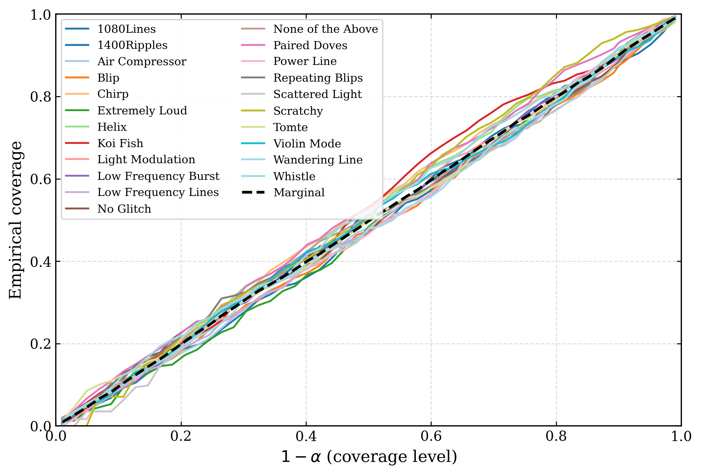
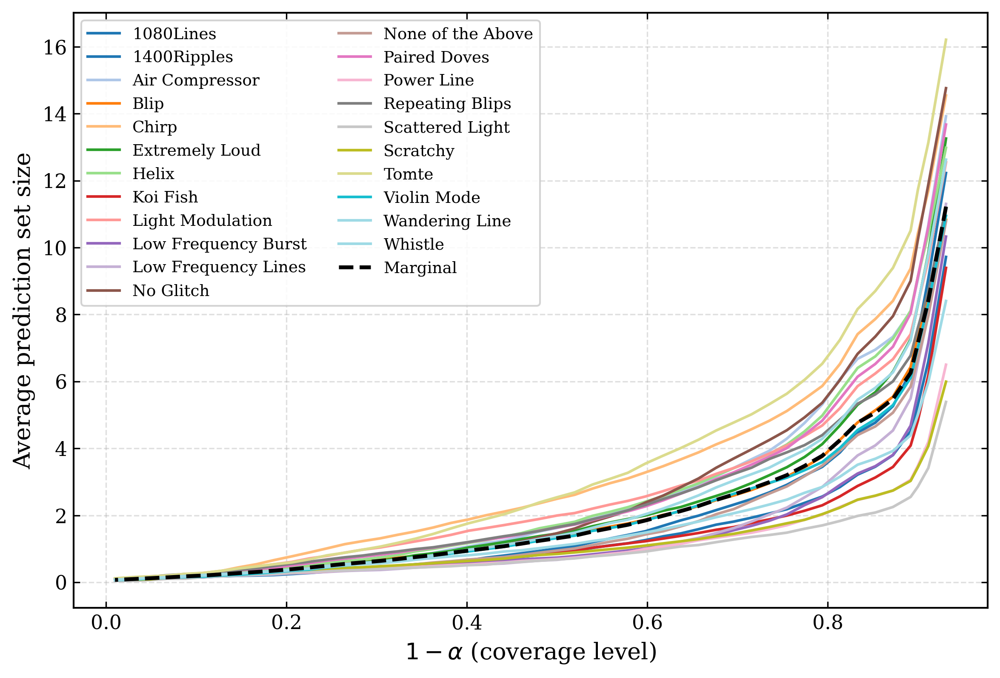
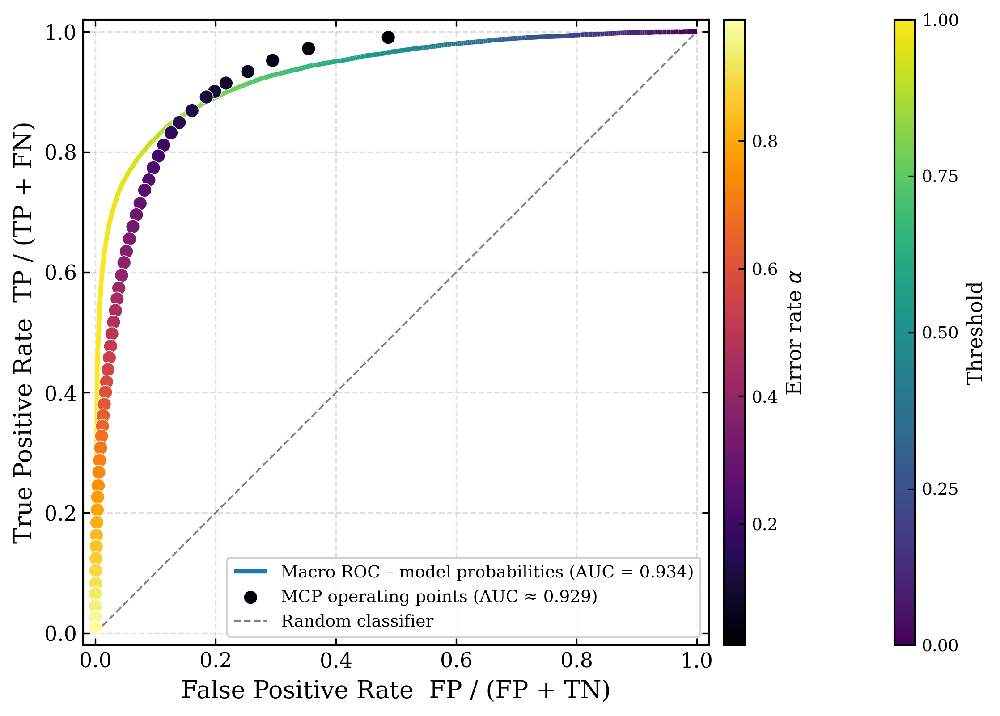
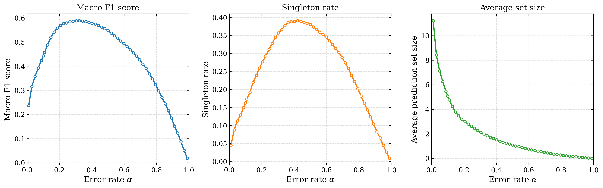
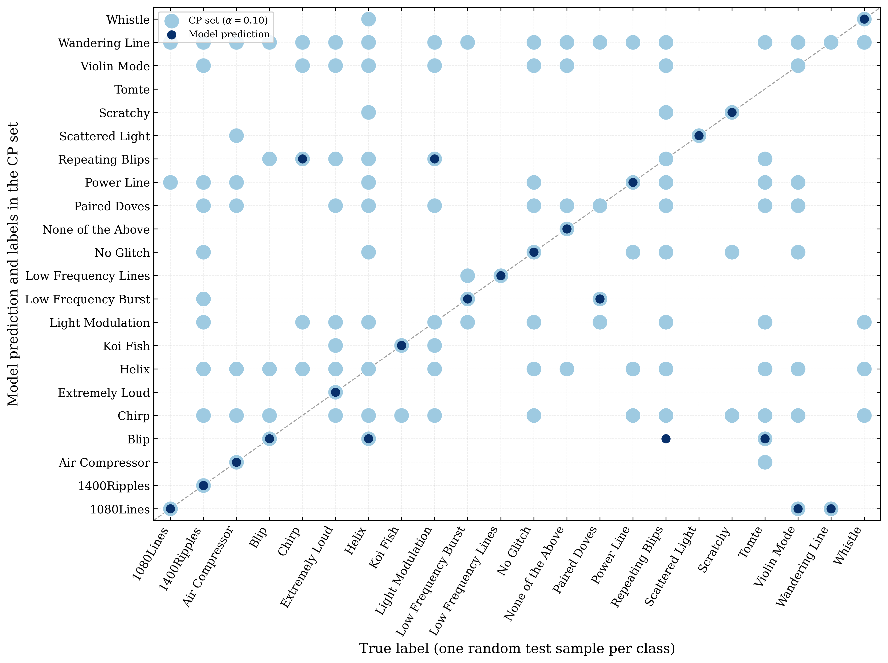

# MCP Tool

This repository is a small tool for studying a classification model with **Mondrian Conformal Prediction (MCP)** and for extracting **prediction sets** from model score/probability CSV files.

It supports:
- one combined CSV that is split into calibration and test data
- two separate CSVs: `calibration.csv` and `test.csv`
- calibration-only export of `alpha -> qhat_<class>` values
- plots and metrics for the test-set prediction sets

## What You Give

Each input CSV should contain:
- `true_label`
- one column per class score/probability

Example:

```csv
true_label, ClassA, ClassB, ClassC
ClassA,0.82,0.12,0.06
ClassC,0.05,0.10,0.85
```

## What You Get

For a run with the prefix `GravitySpy`, the tool saves:
- `GravitySpy_qhat.csv`
- `GravitySpy_metrics.csv`
- `GravitySpy_coverage.png` and `.pdf`
- `GravitySpy_setsize.png` and `.pdf`
- `GravitySpy_roc.png` and `.pdf`
- `GravitySpy_alpha_metrics.png` and `.pdf`
- `GravitySpy_fig2_scatter.png` and `.pdf`

The scatter plot shows:
- dark blue: model prediction
- light blue: other labels in the conformal prediction set

## Quick Usage

### 1. One Combined CSV

CLI:

```bash
python GravitySpy_ExampleCLI.py glitch_confidence_data_1500.csv --output output
```

Notebook:

```python
from mcp import MCPTool

mcp = MCPTool("glitch_confidence_data_1500.csv", alpha=0.1).run()
mcp.export_qhat_csv("output/GravitySpy_qhat.csv")
mcp.export_split_csvs("output/calibration.csv", "output/test.csv")
mcp.plot_all(output_dir="output", prefix="GravitySpy", include_fig2_scatter=True)
```

This writes everything into [output](/Users/srinadb/Desktop/ConformalPrediction/output).

### 2. Separate Calibration and Test CSVs

CLI:

```bash
python GravitySpy_Split_ExampleCLI.py calibration.csv test.csv --output output_split
```

Notebook:

```python
from mcp import MCPTool

qhat_builder = MCPTool.from_calibration_csv("calibration.csv", alpha=0.1)
qhat_builder.export_qhat_csv("output_split/GravitySpy_qhat.csv")

mcp = MCPTool.from_qhat_csv(
    "output_split/GravitySpy_qhat.csv",
    "test.csv",
    alpha=0.1,
).run()

mcp.plot_all(output_dir="output_split", prefix="GravitySpy", include_fig2_scatter=True)
```

This writes everything into [output_split](/Users/srinadb/Desktop/ConformalPrediction/output_split).

### 3. Only Export `alpha vs qhat` From Calibration Data

```bash
python cli.py --calibration-csv calibration.csv --qhat-only --output output_split --prefix GravitySpy
```

## Current Example Outputs

Combined CSV workflow:







## Main Files

- [mcp](/mcp): package for notebooks and scripts
- [cli.py](/cli.py): general CLI
- [GravitySpy_Example.ipynb](/GravitySpy_Example.ipynb): one combined CSV workflow
- [GravitySpy_QhatWorkflow.ipynb](/GravitySpy_QhatWorkflow.ipynb): separate calibration/test workflow
- [GravitySpy_ExampleCLI.py](/GravitySpy_ExampleCLI.py): one combined CSV example CLI
- [GravitySpy_Split_ExampleCLI.py](/GravitySpy_Split_ExampleCLI.py): separate calibration/test example CLI

## Notes

- default `alpha = 0.1`
- default combined split is `50% calibration / 50% test`
- default alpha sweep uses `51` values from `0.01` to `0.99`
- The requested alpha is also included exactly in the saved sweep
